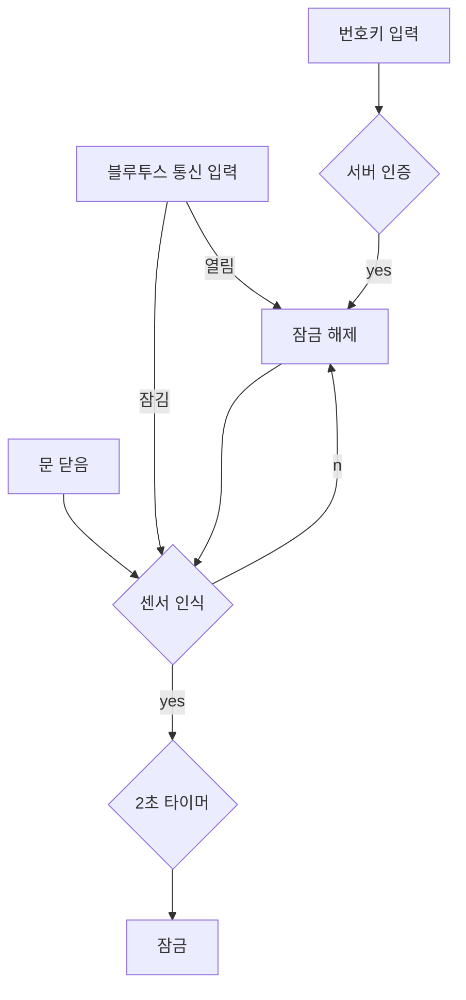

# 회로 공부를 시작해보자

## 무엇을 만들기 고민해보자

### 시건 장치
- 번호 입력 또는 통신을 통해 잠금/해제하는 장치

#### 플로우

#### 필요한 구성요소
1. MCU
- uart 지원 (bluetooth, wifi)
- pwm 지원 (servo motor)
2. bluetooth module
3. wifi module
4. servo motor x2
5. IR sensor(ant detecting sensor possible) x2
6. key pad module

#### 회로도
대충 그림

#### Foot Print
표시만 함 (에러)

#### pcb
(에러)